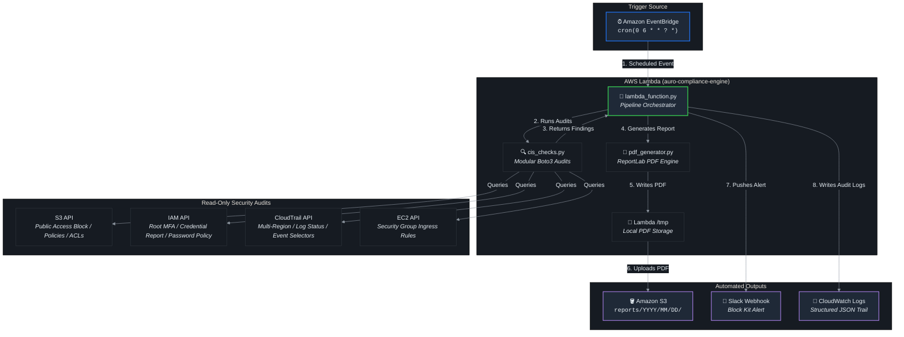

# Auro — Automated Cloud Compliance Engine

<div align="center">


**A production-grade, zero-cost serverless pipeline that runs daily CIS Benchmark v1.4 checks across AWS accounts, auto-generates professional PDF compliance reports, and delivers real-time Slack alerts — no AWS Config Rules required.**

</div>

---

## Table of Contents

1. [Project Overview](#1-project-overview)
2. [Architecture](#2-architecture)
3. [Zero-Cost Engineering Design](#3-zero-cost-engineering-design)
4. [CIS Benchmark Controls Implemented](#4-cis-benchmark-controls-implemented)
5. [Repository Structure](#5-repository-structure)
6. [Quick Start](#6-quick-start)
7. [Configuration](#7-configuration)
8. [Deployment](#8-deployment)
9. [Output Artifacts](#9-output-artifacts)
10. [Security Design Decisions](#10-security-design-decisions)
11. [Technical Deep-Dive](#11-technical-deep-dive)
12. [Business Value](#12-business-value)
13. [Roadmap](#13-roadmap)

---

## 1. Project Overview

Auro is a fully automated, **serverless cloud security compliance engine** built to demonstrate enterprise-level proficiency in:

- **Python Automation & Boto3**: Custom compliance check logic that directly queries AWS APIs — no managed compliance service required
- **Serverless Architecture**: AWS Lambda + Amazon EventBridge with cold-start optimisation and proper error boundaries
- **Security Engineering**: CIS Benchmark v1.4 implementation, least-privilege IAM, secrets management patterns
- **Reporting Automation**: Programmatic PDF generation using ReportLab with a professional dark-mode design system
- **DevOps Practices**: Infrastructure-as-Code (CloudFormation), Makefile automation, unit testing with mocks, `.env`-based config

> **Real-World Context**: This project replicates the operational architecture used in enterprise managed security service providers (MSSPs) that run daily compliance sweeps across client AWS accounts. The traditional approach uses AWS Config Rules — which cost **$0.001 per evaluation** and can accumulate significant charges at scale. Auro replaces this with pure Boto3, reducing per-run cost to **$0.00**.

---

## 2. Architecture




**Data Flow:**

1. EventBridge fires the scheduled rule at `cron(0 6 * * ? *)` — daily at 06:00 UTC
2. Lambda cold-starts; reads config from environment variables (no secrets manager cold-start latency)
3. `cis_checks.run_all_checks()` executes 5 CIS check functions sequentially, each returning a structured `CheckFinding` dataclass
4. `pdf_generator.generate_pdf_report()` renders a multi-page PDF with executive summary, findings table, and remediation quick-reference into `/tmp`
5. PDF is uploaded to S3 with date-partitioned keys (`reports/YYYY/MM/DD/`) and AES-256 server-side encryption
6. Slack `POST` to Incoming Webhook with Block Kit payload (coloured sidebar + structured finding fields)
7. Structured JSON response persisted to CloudWatch Logs for audit trail

---

## 3. Zero-Cost Engineering Design

> **The key architectural decision that separates Auro from a naive AWS Config implementation.**

### The Problem with AWS Config Rules

AWS Config charges `$0.001 per configuration item recorded` and `$0.001 per rule evaluation`. For an account with 100 resources evaluated by 20 Config Rules daily:

```
20 rules × 100 resources × 365 days = 730,000 evaluations/year
Cost: $730/year per AWS account
```

At an MSSP managing 50 client accounts, this becomes **$36,500/year** just for compliance checking.

### The Auro Approach: Direct Boto3 API Calls

Auro replaces Config Rules with direct, read-only Boto3 API calls that run **within Lambda's free tier**:

| Resource | Free Tier Limit | Auro Usage | Cost |
|---|---|---|---|
| Lambda Invocations | 1,000,000/month | 30/month (daily) | **$0.00** |
| Lambda GB-seconds | 400,000/month | ~30 × (256 MB × 45 sec avg) ≈ 337 GB-s | **$0.00** |
| EventBridge Rules | 50 free rules | 1 rule | **$0.00** |
| S3 PUT requests | 2,000/month free | 30/month | **$0.00** |
| CloudWatch Logs | 5 GB ingestion free | ~50 KB/run = 1.5 MB/month | **$0.00** |
| IAM/STS API calls | Always free | Read-only | **$0.00** |
| CloudTrail API calls | Always free | Read-only | **$0.00** |

**Total monthly cost: $0.00** (assuming < 5 GB S3 storage; add ~$0.11/GB beyond free tier)

### Trade-offs & Mitigations

| Trade-off | Mitigation |
|---|---|
| No continuous evaluation (Config runs on change) | EventBridge cron covers regulatory daily-check requirements (SOC 2, PCI-DSS) |
| Manual pagination for large accounts | Boto3 paginators implemented for Security Groups; can be extended |
| Lambda 15-minute hard timeout | Checks complete in < 60 seconds for typical accounts; can parallelize with threading |

---

## 4. CIS Benchmark Controls Implemented

All checks implement **CIS AWS Foundations Benchmark v1.4** controls:

| Check ID | CIS Control | Severity | Method |
|---|---|---|---|
| `CIS-1.1/1.5` | Root Account: MFA enabled, no active access keys | **CRITICAL** | `iam:GetAccountSummary` + Credential Report CSV |
| `CIS-1.8` | IAM Password Policy: min length 14, complexity, reuse, max age | **HIGH** | `iam:GetAccountPasswordPolicy` |
| `CIS-3.1/3.2` | CloudTrail: multi-region, logging active, log validation enabled | **HIGH** | `cloudtrail:DescribeTrails` + `GetTrailStatus` + `GetEventSelectors` |
| `CIS-2.1.2/2.1.5` | S3 Public Access: Block Public Access (all 4 flags), policy, ACL | **CRITICAL** | `s3:GetBucketPublicAccessBlock` + `GetBucketPolicyStatus` + `GetBucketAcl` |
| `CIS-5.2/5.3` | Security Groups: no unrestricted ingress on SSH (22) / RDP (3389) | **HIGH** | `ec2:DescribeSecurityGroups` with paginator |

### Check Design Principles

- **Defense in Depth**: S3 check evaluates all three attack vectors (PAB config, bucket policy, ACL) — not just the top-level block
- **Fault Isolation**: Each check function is wrapped in a `try/except`; one broken check never aborts the pipeline
- **Structured Output**: `CheckFinding` dataclass with `check_id`, `status`, `severity`, `resources`, `details` — machine-readable and report-ready
- **Audit Trail**: Every check logs to CloudWatch with structured fields for SIEM ingestion

---

## 5. Repository Structure

```
auro-compliance-engine/
│
├── lambda_function.py        # 🎯 Lambda entry point & pipeline orchestrator
├── cis_checks.py             # 🔍 CIS Benchmark check implementations (Boto3)
├── pdf_generator.py          # 📄 ReportLab PDF generation engine
│
├── iam-policy.json           # 🔐 Least-privilege IAM policy (Lambda execution role)
├── cloudformation.yaml       # ☁️  IaC: Lambda + EventBridge + IAM + CloudWatch
├── requirements.txt          # 📦 Python dependencies (reportlab, requests)
├── Makefile                  # 🛠  Developer workflow automation
│
├── tests/
│   ├── __init__.py
│   └── test_cis_checks.py    # ✅ Unit tests (unittest.mock — no real AWS calls)
│
├── .env.example              # 🔑 Environment variable template
├── .gitignore                # 🚫 Git exclusions (secrets, build artifacts)
└── README.md                 # 📖 This file
```

---

## 6. Quick Start

### Prerequisites

- Python 3.12+
- AWS CLI configured (`aws configure`)
- An AWS account (Free Tier is sufficient)
- A Slack Incoming Webhook URL (optional but recommended)

### 1. Clone & Install

```bash
git clone https://github.com/YOUR_USERNAME/auro-compliance-engine.git
cd auro-compliance-engine

# Create isolated virtual environment
python3 -m venv .venv && source .venv/bin/activate

# Install dependencies
make install
```

### 2. Configure Environment

```bash
cp .env.example .env
# Edit .env with your Slack webhook and S3 bucket name
vim .env
```

### 3. Run Locally (Against Your AWS Account)

```bash
# Load environment and run the full pipeline locally
export $(cat .env | xargs)
python lambda_function.py
```

The script will:
- Execute all 5 CIS checks against your configured AWS profile
- Generate a PDF report in `/tmp/` (or current directory)
- Send a Slack notification (if `SLACK_WEBHOOK_URL` is set)
- Print a structured JSON result to stdout

### 4. Run Tests

```bash
make test
# Runs 12 unit tests with coverage report
# No real AWS credentials required — all API calls are mocked
```

---

## 7. Configuration

All configuration is managed via environment variables — never hardcoded:

| Variable | Required | Description |
|---|---|---|
| `SLACK_WEBHOOK_URL` | Optional | Slack Incoming Webhook URL. If unset, Slack step is gracefully skipped |
| `S3_REPORTS_BUCKET` | Optional | S3 bucket name for PDF uploads. If unset, PDF is generated but not persisted |
| `AWS_REGION` | Optional | Target region (default: `us-east-1`). Injected automatically on Lambda |
| `LOG_LEVEL` | Optional | `DEBUG` / `INFO` / `WARNING` (default: `INFO`) |

> **Security Note**: Secrets are injected as Lambda environment variables, not hardcoded. For production deployments with multiple accounts, integrate AWS Secrets Manager or Parameter Store and pull values at cold-start.

---

## 8. Deployment

### Option A: Makefile (Recommended)

```bash
# 1. Build the Lambda Layer (reportlab + requests)
make layer

# 2. Publish layer to AWS
make publish-layer
# Note the Layer ARN from output; add it to cloudformation.yaml Layers section

# 3. Package function code
make package

# 4. Deploy CloudFormation stack
SLACK_WEBHOOK_URL="https://hooks.slack.com/..." \
S3_REPORTS_BUCKET="my-reports-bucket" \
make deploy
```

### Option B: Manual AWS CLI

```bash
# Package
zip -j .build/auro-function.zip lambda_function.py cis_checks.py pdf_generator.py

# Deploy CloudFormation
aws cloudformation deploy \
  --template-file cloudformation.yaml \
  --stack-name auro-compliance-engine \
  --parameter-overrides \
    SlackWebhookUrl="https://hooks.slack.com/services/..." \
    ReportsBucketName="my-reports-bucket" \
  --capabilities CAPABILITY_NAMED_IAM \
  --region us-east-1

# Update function code
aws lambda update-function-code \
  --function-name auro-compliance-engine \
  --zip-file fileb://.build/auro-function.zip
```

### Smoke Test

```bash
# Manually invoke and tail logs
make invoke
make logs
```

---

## 9. Output Artifacts

### PDF Compliance Report

Generated by `pdf_generator.py` using ReportLab. Features:

- **Cover Page**: Account ID, region, timestamp, classification, framework version
- **Executive Summary**: KPI tiles (PASS / FAIL / ERRORS / COMPLIANCE %), narrative, findings table
- **Detailed Findings**: Per-check blocks with colour-coded status banners, description, detail text, affected resource ARNs
- **Remediation Quick Reference**: Consolidated table of all failed checks with specific remediation steps

Stored at: `s3://<bucket>/reports/YYYY/MM/DD/compliance_report_<account_id>_<date>.pdf`

### Slack Notification

Rich Block Kit message with:
- Compliance score with traffic-light colour sidebar (🟢 ≥80% / 🟡 ≥50% / 🔴 <50%)
- Per-finding status icons with severity tags
- Direct S3 URI to the PDF report

### CloudWatch Logs (Structured)

```json
{
  "statusCode": 200,
  "engine": "auro-v1.0.0",
  "account_id": "123456789012",
  "summary": {
    "total_checks": 5,
    "passed": 3,
    "failed": 2,
    "errors": 0,
    "compliance_pct": 60
  },
  "findings": [
    {
      "check_id": "CIS-2.1.2/2.1.5",
      "title": "S3 Bucket Public Access",
      "status": "FAIL",
      "severity": "CRITICAL",
      "resources": ["my-public-bucket", "old-data-bucket"]
    }
  ]
}
```

---

## 10. Security Design Decisions

| Decision | Rationale |
|---|---|
| **Least-privilege IAM** | Execution role has only read permissions (`List*`, `Get*`, `Describe*`) plus targeted `s3:PutObject` scoped to the reports bucket prefix. No `*` actions. |
| **No hardcoded credentials** | All secrets via environment variables. `SLACK_WEBHOOK_URL` passed as `NoEcho` in CloudFormation parameter to prevent CloudTrail logging |
| **AES-256 S3 encryption** | PDF reports contain compliance findings that could aid attackers; encrypted at rest with `ServerSideEncryption: AES256` on every `PutObject` |
| **Read-only API calls** | All Boto3 checks use read-only API actions. The engine cannot modify any AWS resource — safe to run in production accounts |
| **Error isolation** | Each check wrapped in `try/except`; a single check failure returns a structured `ERROR` finding and the pipeline continues |
| **Log retention policy** | CloudWatch Log Group created with explicit 30-day retention to control storage costs and data minimisation compliance |
| **No VPC dependency** | Lambda runs without VPC attachment (no NAT Gateway cost); API calls go over AWS service endpoints over HTTPS |

---

## 11. Technical Deep-Dive

### Why Boto3 Over AWS Config Rules?

AWS Config Rules (managed or custom Lambda-backed) are the AWS-native approach to compliance checking. However, they introduce:

1. **Cost**: Per-evaluation pricing that scales with resource count and rule count
2. **Deployment complexity**: Config must be enabled in every region, rules must be deployed per-region
3. **Evaluation lag**: Config operates on configuration change events; a rule may not evaluate a newly public S3 bucket for minutes
4. **State management**: Config stores configuration history in S3; additional cost and complexity

Auro's direct Boto3 approach offers:
- **Instant, on-demand evaluation** at any scheduled frequency
- **Zero per-check cost** (only Lambda execution time)
- **Full control** over check logic, error handling, and output format
- **Portability**: Runs as a local script, in Lambda, in a container, or in a CI/CD pipeline

### Credential Report Strategy

The IAM Credential Report is a CSV file generated by AWS that contains the authentication status of all IAM users and the root account. Key implementation details:

```python
# Trigger generation (AWS caches for up to 4 hours)
for _ in range(10):
    resp = iam.generate_credential_report()
    if resp["State"] == "COMPLETE":
        break
    time.sleep(2)

# Fetch and decode
report = iam.get_credential_report()["Content"].decode("utf-8")
```

This avoids a separate `iam:ListUsers` + per-user `GetLoginProfile` + `ListMFADevices` chain — reducing API call count from O(n users) to O(1).

### ReportLab Architecture

The PDF engine uses `BaseDocTemplate` with a custom `PageTemplate` subclass (`DarkPageTemplate`) that overrides `beforeDrawPage()` to:
1. Paint a full-page dark background (`#0D1117` — GitHub dark)
2. Draw a coloured header stripe with account metadata
3. Render a page number + framework citation footer

Each check finding is rendered as a `KeepTogether` flowable — preventing page breaks mid-finding block.

### Unit Testing Strategy

All 12 unit tests use `unittest.mock.patch` to mock `boto3.client` — **zero real AWS API calls**. This means:
- Tests run in any environment (local, CI/CD) without AWS credentials
- Tests are deterministic and fast (< 1 second)
- Failure scenarios (e.g., `NoSuchEntity`, `ClientError`) are simulated precisely

```python
@patch("cis_checks.boto3.client")
def test_root_active_access_key_fail(self, mock_boto_client):
    mock_iam = MagicMock()
    mock_boto_client.return_value = mock_iam
    mock_iam.get_account_summary.return_value = {"SummaryMap": {"AccountMFAEnabled": 1}}
    # ... inject mock credential report CSV
    result = check_root_mfa_and_usage()
    self.assertEqual(result.status, CheckStatus.FAIL)
```

---

## 12. Business Value

> **For the security analyst interviewer**: This section demonstrates understanding of security program economics — not just technical execution.

### Quantified Risk Reduction

| CIS Control | Business Risk Mitigated | Real-World Breach Example |
|---|---|---|
| Root MFA (CIS 1.1/1.5) | Credential theft → full account takeover | Capital One breach: root-equivalent role used to exfiltrate S3 data |
| Password Policy (CIS 1.8) | Weak credentials → lateral movement | Uber breach: hardcoded credentials in GitHub led to AWS compromise |
| CloudTrail (CIS 3.1) | Undetected API abuse, no forensic trail | Average cost to investigate breach without logs: +$1.2M (IBM CODB 2023) |
| S3 Public Access (CIS 2.1.2) | Data exposure, regulatory fines | 3 billion+ records exposed via misconfigured S3 buckets in 2022-2023 |
| Security Groups (CIS 5.2) | Unrestricted attack surface, RCE vector | 40% of cloud breaches initiated via exposed management ports (Unit 42, 2023) |

### Compliance Framework Mapping

| Auro Check | SOC 2 | PCI-DSS | HIPAA | ISO 27001 |
|---|---|---|---|---|
| Root MFA | CC6.1 | Req 8.3 | §164.312(d) | A.9.4.2 |
| Password Policy | CC6.1 | Req 8.3.6 | §164.312(d) | A.9.4.3 |
| CloudTrail | CC7.2 | Req 10.2 | §164.312(b) | A.12.4.1 |
| S3 Public Access | CC6.1 | Req 3.4 | §164.312(a)(1) | A.13.1.3 |
| Security Groups | CC6.6 | Req 1.3 | §164.312(a)(1) | A.13.1.1 |

### MSSP Use Case

At scale across 50 client accounts:
- **Config Rules approach**: ~$36,500/year in AWS charges alone
- **Auro approach**: ~$0/year (Lambda + S3 free tier covers 50 daily runs)
- **Additional value**: Branded PDF reports deliverable to clients as evidence of continuous monitoring

---

## 13. Roadmap

- [ ] **Multi-account support**: Assume cross-account IAM roles via `sts:AssumeRole` for MSSP scenarios
- [ ] **Threading**: Run checks concurrently with `concurrent.futures.ThreadPoolExecutor` (reduce runtime from 45s to ~10s)
- [ ] **Trend analysis**: S3 Select queries on historical reports to track compliance score over time
- [ ] **Additional CIS controls**: Extend to 20+ checks covering KMS key rotation, VPC Flow Logs, GuardDuty status
- [ ] **JIRA integration**: Auto-create tickets for CRITICAL/HIGH findings via JIRA REST API
- [ ] **Terraform IaC**: Migrate CloudFormation to Terraform for multi-cloud portability
- [ ] **GitHub Actions CI**: Auto-run `make test` + `make lint` on every pull request

---

## License

MIT — see [LICENSE](LICENSE) file.

---

<div align="center">

**Built with ☁️ and 🔐 to demonstrate that security automation should be both rigorous and economically sound.**

*CIS Benchmark v1.4 | AWS Lambda Free Tier | Python 3.12 | Boto3 | ReportLab | Slack Block Kit*

</div>
